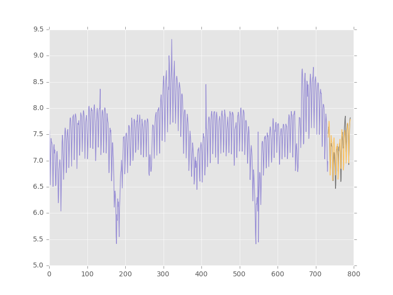
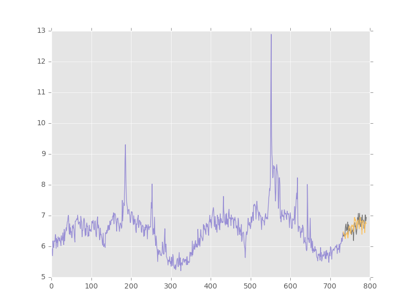
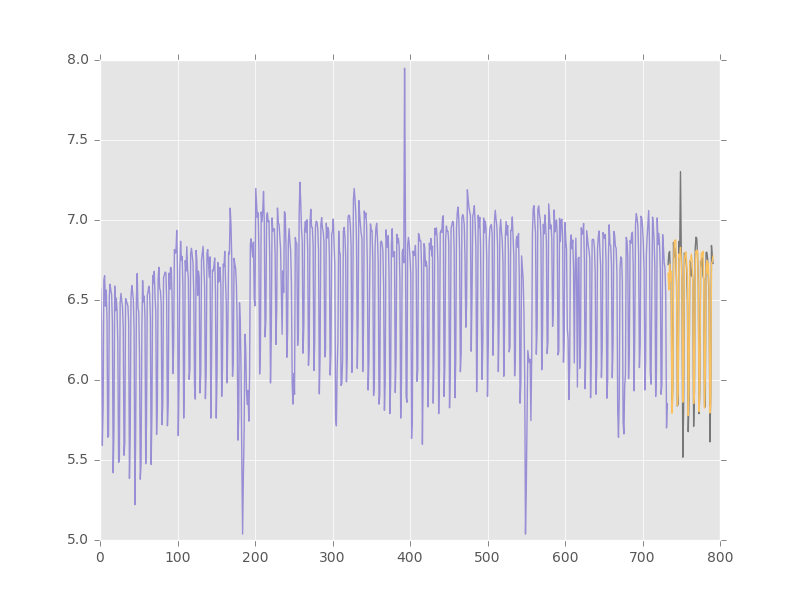
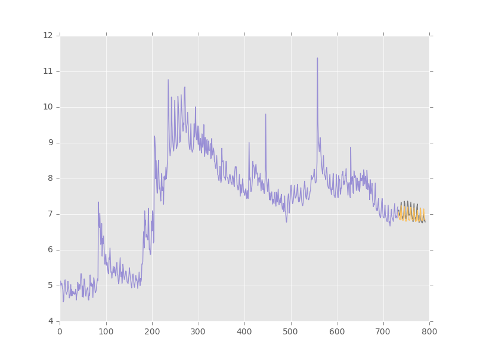
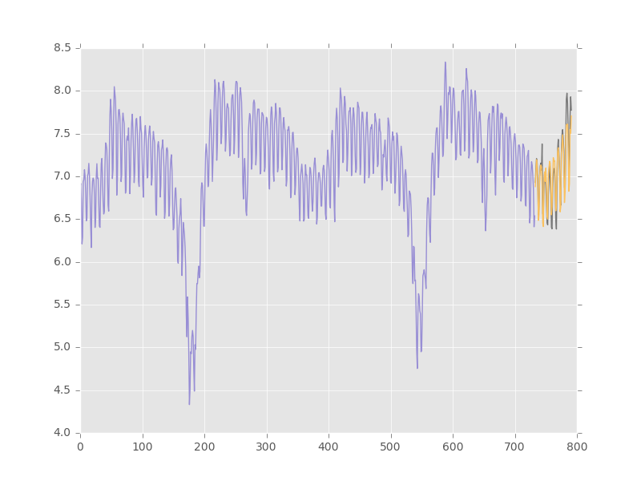
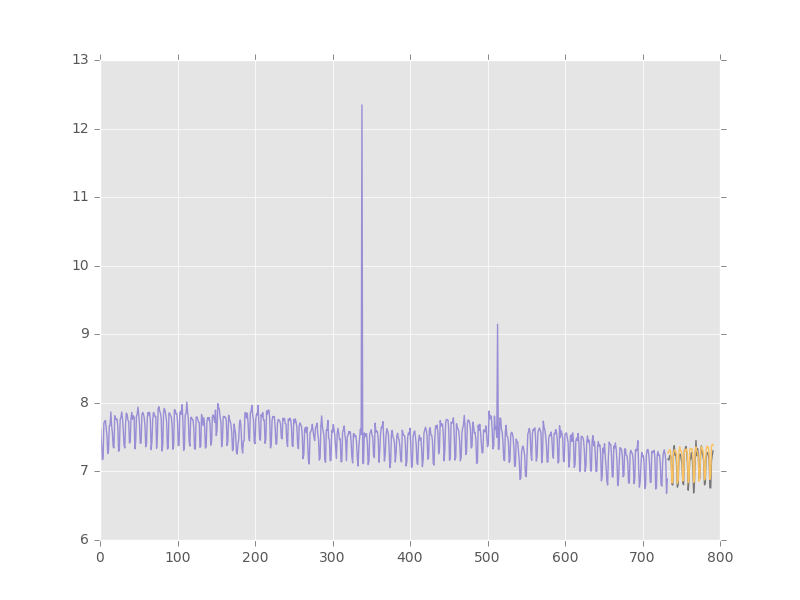

# Web Traffic Forecasting
My solution for the Web Traffic Forecasting competition hosted on Kaggle.

## The Task
The training dataset consists of approximately 145k time series.  Each of these time series represents a number of daily views of a different Wikipedia article, starting from July 1st, 2015 up until September 10th, 2017. The goal is to forecast the daily views between September 13th, 2017 and November 13th, 2017 for each article in the dataset. The name of the article as well as the type of traffic (all, mobile, desktop, spider) is given for each article.

The evaluation metric is symmetric mean absolute percentage error (SMAPE).

## The Approach
A single neural network was used to model all 145k time series.  The model architecture is similar to WaveNet, consisting of a stack of dilated causal convolutions, as demonstrated in the [diagram](https://deepmind.com/blog/wavenet-generative-model-raw-audio/) below.

  

A few modifications were made to adapt the model to generate coherent predictions for the entire forecast horizon (64 days).  WaveNet was trained using next step prediction, so errors can accumulate as the model generates long sequences in the absence of conditioning information. To remedy this, we trained the model to minimize the loss when unraveled for 64 steps.  We adopt a sequence to sequence approach where the encoder and decoder do not share parameters.  This allows the decoder to handle the accumulating noise when generating long sequences.

Below are some sample forecasts to demonstrate some of the patterns that the network can capture.  The forecasted values are in yellow, and the ground truth values (not used in training or validation) are shown in grey.  The y-axis is log transformed.

 
 
 

## Requirements
12 GB GPU (recommended), Python 2.7

Python packages:
  - numpy==1.13.1
  - pandas==0.19.2
  - scikit-learn==0.18.1
  - tensorflow==1.3.0
